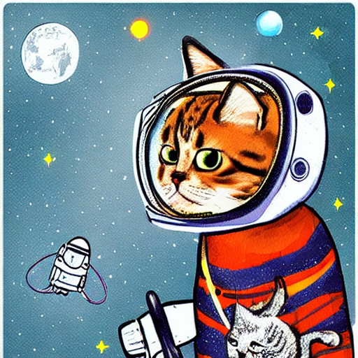

# AI Sketchbook 

This project demonstrates how to use Stable Diffusion (version 1.5) with Hugging Face Diffusers to generate images from text prompts. The model is integrated with Gradio, a simple and interactive web-based UI framework, allowing users to experiment with AI-generated images directly in their browser.

🚀 **Key Features:**
- **Text-to-Image** – Enter a prompt and generate AI-created images in seconds.
- **Customizable Parameters** – Adjust guidance scale and steps for fine-tuned results.
- **One-Click Download** – Save generated images directly to your device.
- **Simple Setup** – Built with Python and Hugging Face’s Diffusers library.

✨ Generate art, explore creativity, and bring your ideas to life with AI Sketchbook!
